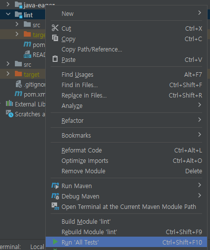

## Maplint

:warning: Any updates might be delayed until the Java static analyzer project is complete in another repository.

**Maplint** is a lint program to check errors in Mapped SQL Statement.
It's being developed based on a recent paper that introduces four analysis methods 
for finding out various errors in statements. Main concepts are 
the access to the database and the compilation of Java code during development phase.

### Project structure

Maplint is a multi-module java project based on Maven.

- java-eager: Project Import, Type Finder for Java Class
- lint: Command Line Interface, MyBatis parser, Diagnostic package

:warning: At some point, java-eager project wil be moved to another repository.

### :triangular_flag_on_post: Feature List

|                                                               | Description                                                                             |              Status              |
|---------------------------------------------------------------|-----------------------------------------------------------------------------------------|:--------------------------------:|
| **:green_square: Key Feature**                                |                                                                                         |                                  |
| SQL Grammar Check                                             | Check if DDL, DML statements are correct grammatically                                  |        :heavy_check_mark:        |
| Object Existence Check                                        | Check if the column and table exists in the database  with the JDBC Connection       |        :heavy_check_mark:        |
| Property Existence Check                                      | Check if the java property exists in classes, source codes                              |        :heavy_check_mark:        |
| Type Compatibility Check                                      | Check type compatibility for every binary expression  consisting of Column and Value |        :heavy_check_mark:        |
| Diagnostics & Message                                         | Data structure for the trace log and meaningful message for the developer               |     :heavy_check_mark:     |
| Command Line Interface (Facade layer) | Facade API of Unit Test for CLI                                                         |     :heavy_check_mark:     |
| Command Line Interface (Windows App Packaging) | Release first executable                                                         |     :calendar: this year     |
| **:green_square: Advanced Feature**                           |                                                                                         |                                  |
| Dynamic SQL                                                   | -                                                                                       | :calendar: this year |
| Mapper Annotations (@Select, @Update, ...)                 | -                                                                                       | :calendar: this year |
| Auto download for JDK and tools                               | -                                                                                       | :calendar: this year |
| IDE Plugins (vscode, IntelliJ)                                | -                                                                                       | :calendar: this year |

:warning: This lint is designed based on MyBatis 3.5.9 and JDK 13. It will be tested and upgraded to support more versions of JDK and up-to-date MyBatis.

### Getting started

This project doesn't support CLI yet. It's been planned.
Currently, uou can only run Unit Testing in Intellij for each submodule.

### Background

This project is based on a recent paper related to MyBatis Development Productivity Improvement. 
That paper provides methods following four types of errors that developers often encounters during the project using MyBatis.
- Grammar Error: Use wrong grammar in SQL Statement
- Object Name Error: Use wrong names of the table and column in the database
- Property Name Error: Use wrong property names
- Type Incompatibility Error: Use incompatible types

### References
- https://en.wikipedia.org/wiki/Prepared_statement
- https://dev.mysql.com/doc/refman/8.0/en/insert.html
- https://mybatis.org/mybatis-3/sqlmap-xml.html
- https://mybatis.org/spring/using-api.html